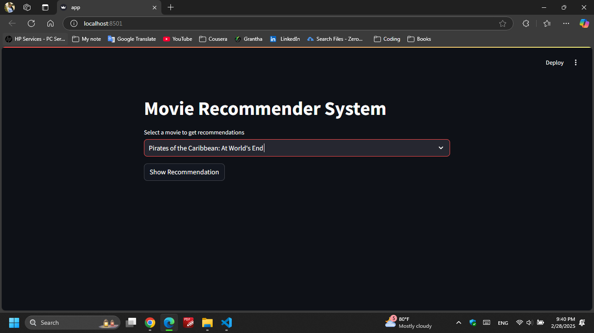
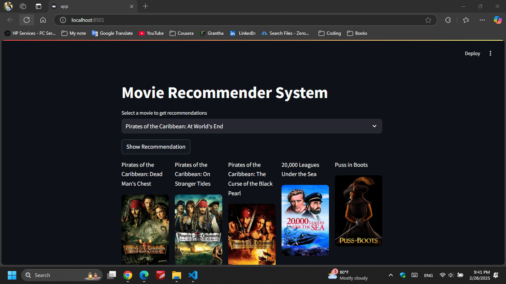

# Movie Recommender System 🎬

A Streamlit-based web app that recommends movies based on similarity and displays posters using the TMDB API.

[](demo.mp4)


## Features ✨
- Recommends 5 similar movies based on user selection.
- Displays movie posters fetched from TMDB.
- Simple and intuitive user interface.

## Installation 🛠️

1. **Clone the repository**:
   ```bash
   git clone https://github.com/piyuminadee/movie-recommended-system.git
   cd movie-recommender
   ```
2. **Install dependencies
   ```bash
   pip install -r requirements.txt
   ```
3. Usage 🚀
   1.Run the app locally:
  ```bash
  streamlit run app.py
  ```
  2. Select a movie from the dropdown.
  3. Click Show Recommendation to see results.
     
## Dependencies 📦
Python 3.9+
Streamlit
Pandas
Requests
Scikit-learn
NumPy

## Dataset 📂    
movies.pkl: Contains movie titles and metadata.
similarity.pkl: Precomputed similarity matrix for movies.

## API Reference 🌐
TMDB API: Used to fetch movie posters. <a href="https://www.themoviedb.org/settings/api">API Documentation.</a>

## Troubleshooting 🔧
File Not Found Error: Ensure movies.pkl and similarity.pkl are in the project root.
Dependency Issues: Use the exact versions in requirements.txt.
API Errors: Verify the TMDB API key in app.py.

## Acknowledgements 
Dataset: <a href="https://www.kaggle.com/datasets/tmdb/tmdb-movie-metadata">Kaggle Movies Dataset.</a>
Poster Images: <a href="https://www.themoviedb.org/">The Movie Database (TMDB).</a>
UI: Built with <a href="https://streamlit.io/">Streamlit. </a>



